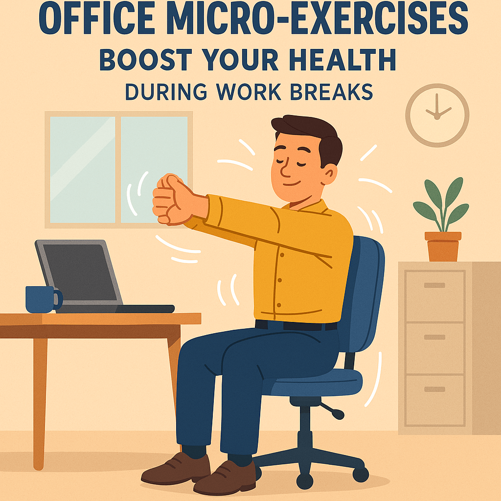

# Office Micro-Exercises: Boost Your Health During Work Breaks

In today’s fast-paced world, spending long hours seated at a desk has become the norm for many of us. While it’s great for productivity, this sedentary lifestyle can take a toll on our health—think stiff necks, sore shoulders, and sluggish circulation. The good news? You don’t need a gym membership or fancy equipment to counteract these effects. Enter “micro-exercises”—short, simple movements you can do right at your desk or in the office during brief work breaks. These small efforts can relieve physical fatigue, boost blood flow, and elevate your overall well-being without disrupting your busy schedule.

In this blog post, we’ll explore a variety of office-friendly micro-exercises that require minimal time and space. Let’s dive into these easy moves to help you stay energized and healthy throughout the workday!

## Why Micro-Exercises Matter

Sitting for extended periods can lead to muscle stiffness, poor posture, and even increased risks of chronic conditions like heart disease or diabetes. Micro-exercises are the perfect solution for office workers because they:
- Break up sedentary time with quick bursts of activity.
- Improve circulation to reduce fatigue and brain fog.
- Ease tension in commonly overworked areas like the neck, shoulders, and back.
- Fit seamlessly into your day—no need for a gym or special gear.

Ready to get started? Here are some simple yet effective micro-exercises you can try during your next coffee break.

## 1. Neck and Shoulder Relaxation

**How to Do It:**  
- Sit up straight in your chair with your feet flat on the floor.  
- Slowly tilt your head to the right, bringing your ear toward your shoulder until you feel a gentle stretch. Hold for 15-20 seconds, then switch sides.  
- Next, roll your shoulders backward in a circular motion 5-10 times, then forward for another 5-10 reps.  

**Benefits:**  
This move relieves tension from hunching over a keyboard and helps loosen up tight neck muscles—a common complaint for desk jockeys.

## 2. Seated Leg Stretch

**How to Do It:**  
- While seated, extend one leg straight out in front of you, keeping the other foot flat on the ground.  
- Point your toes upward, then flex them back toward your body. Hold each position for 10 seconds.  
- Switch legs and repeat 2-3 times per side.  

**Benefits:**  
This stretch activates your leg muscles, improves blood flow, and prevents that “numb” feeling from sitting too long.

## 3. Desk Push-Ups

**How to Do It:**  
- Stand up and place your hands shoulder-width apart on the edge of your desk.  
- Step your feet back until your body forms a diagonal line.  
- Bend your elbows to lower your chest toward the desk, then push back up. Aim for 8-12 reps.  

**Benefits:**  
A quick way to engage your upper body and core, this exercise boosts energy and strengthens your arms without leaving your workspace.

## 4. Chair Squats

**How to Do It:**  
- Stand in front of your chair with feet hip-width apart.  
- Lower your body as if you’re about to sit, stopping just before your backside touches the seat.  
- Stand back up and repeat 10-15 times.  

**Benefits:**  
Chair squats activate your glutes and thighs, improving lower-body strength and circulation in just a minute or two.

## Tips to Make Micro-Exercises a Habit

- **Set Reminders:** Use your phone or computer to prompt you every hour or two for a quick movement break.  
- **Start Small:** Even 1-2 minutes of activity can make a difference—build up as you go.  
- **Pair with Routine:** Do a stretch while waiting for your coffee to brew or during a phone call.  
- **Involve Colleagues:** Turn it into a fun office challenge to stay motivated!

## Final Thoughts

You don’t need to overhaul your workday to prioritize your health. These micro-exercises—neck stretches, leg extensions, desk push-ups, and chair squats—are simple, equipment-free ways to combat the downsides of sitting all day. By sneaking in these mini movement breaks, you’ll feel more refreshed, focused, and physically at ease, all while boosting your health index one small step at a time.

So, next time you feel that mid-afternoon slump creeping in, give these exercises a try. Your body (and mind) will thank you! Have a favorite office exercise? Share it with us in the comments below—we’d love to hear your tips!