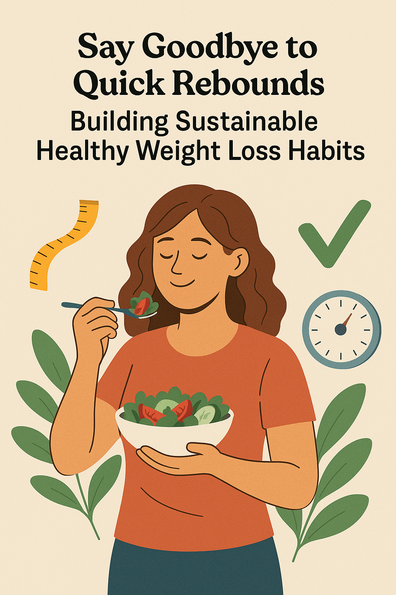

# Say Goodbye to Quick Rebounds: Building Sustainable Healthy Weight Loss Habits

In today’s world, the desire to lose weight is common, and the market is flooded with promises of quick fixes—crash diets, intense workout regimens, and miracle supplements. While these methods might deliver fast results, they often lead to an all-too-familiar problem: the dreaded rebound. Weight comes back just as quickly as it was lost, leaving people frustrated and discouraged. The truth is, sustainable weight loss isn’t about shortcuts; it’s about creating lasting habits that transform your lifestyle. In this blog post, we’ll explore science-backed strategies to help you ditch the rebound cycle and achieve healthy, long-term weight loss through gradual dietary adjustments, regular moderate exercise, and a positive outlook on life.

## Why Quick Fixes Don’t Work

Research consistently shows that rapid weight loss methods, such as extreme calorie restriction or excessive exercise, are rarely sustainable. These approaches often trigger a survival response in your body, slowing your metabolism and increasing cravings as it fights to regain the lost weight. According to a study published in the *Journal of Obesity*, individuals who lose weight gradually and maintain consistent habits are far more likely to keep it off compared to those who opt for drastic measures. The key? Shifting your focus from short-term deprivation to long-term lifestyle changes.

## Step 1: Gradually Adjust Your Diet

One of the biggest mistakes people make when trying to lose weight is overhauling their entire diet overnight. While ambition is great, drastic changes are hard to stick to. Instead, start small and build from there. Here are some practical tips to ease into a healthier eating pattern:

- **Swap, Don’t Eliminate**: Replace processed snacks with nutrient-dense alternatives like nuts, fruits, or yogurt. Over time, your taste buds will adjust, and you’ll crave less junk food.
- **Portion Control**: Use smaller plates to naturally reduce portion sizes without feeling deprived.
- **Incorporate More Plants**: Aim to fill half your plate with vegetables at every meal. They’re low in calories, high in fiber, and keep you full longer.
- **Hydrate Smartly**: Drinking water before meals can curb overeating, and swapping sugary drinks for herbal teas or infused water cuts unnecessary calories.

The goal isn’t to “diet” but to create a way of eating that feels natural and enjoyable—one you can maintain for years, not just weeks.

## Step 2: Move More, Moderately

Exercise doesn’t have to mean hours at the gym or punishing yourself with high-intensity workouts. In fact, studies show that moderate, consistent activity is more effective for sustainable weight loss. The American Heart Association recommends at least 150 minutes of moderate exercise per week—think brisk walking, cycling, or swimming. Here’s how to make movement a habit:

- **Find What You Love**: Whether it’s dancing, hiking, or yoga, pick activities you genuinely enjoy. You’re more likely to stick with something that feels fun rather than forced.
- **Start Small**: If you’re new to exercise, begin with 10-15 minute sessions and gradually increase the duration as your stamina improves.
- **Make It Routine**: Schedule your workouts like appointments. Consistency beats intensity when it comes to long-term results.

Regular movement not only burns calories but also boosts your mood and energy levels, making it easier to stay committed to your goals.

## Step 3: Cultivate a Positive Mindset

Weight loss isn’t just physical—it’s mental too. A positive attitude can be the difference between giving up and pushing forward. Many people fall into the trap of all-or-nothing thinking: one “bad” meal spirals into abandoning their efforts entirely. To break this cycle, try these mindset shifts:

- **Focus on Progress, Not Perfection**: Celebrate small wins, like choosing a healthy snack or completing a workout, rather than fixating on the scale.
- **Be Kind to Yourself**: Slip-ups happen. Instead of beating yourself up, reflect on what you can learn and move on.
- **Set Realistic Goals**: Aim for 0.5-1 pound of weight loss per week, a rate experts consider safe and sustainable.

A study from the *International Journal of Behavioral Nutrition and Physical Activity* found that individuals with a growth mindset—those who view setbacks as opportunities to learn—were more successful at maintaining healthy habits over time.

## The Power of Consistency Over Speed

Sustainable weight loss is a marathon, not a sprint. By making gradual changes to your diet, incorporating moderate exercise, and fostering a positive mindset, you’re not just shedding pounds—you’re building a healthier life. Unlike quick fixes that leave you hungry, tired, and back at square one, these habits grow stronger with time, helping you say goodbye to rebounds for good.

Ready to start? Pick one small change today—swap a soda for water, take a 10-minute walk, or simply write down something you’re grateful for. Small steps lead to big transformations. Here’s to a healthier, happier you—one sustainable habit at a time!
