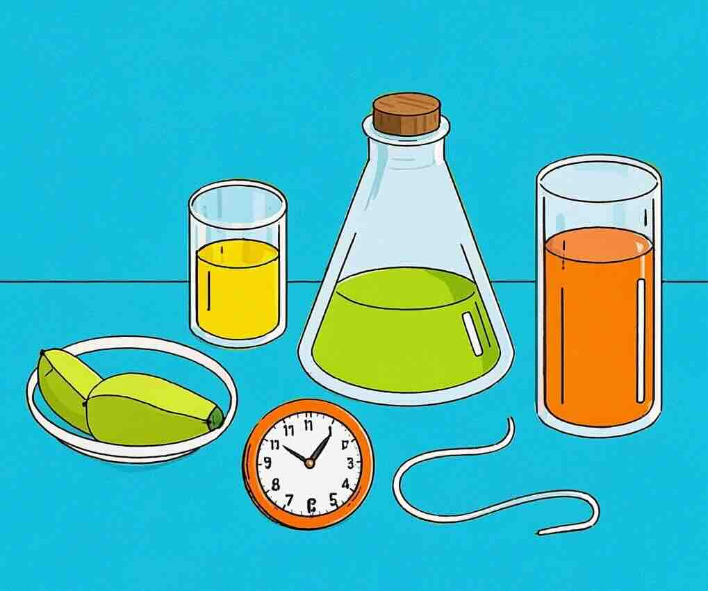

# Scientific Weight Loss

Losing weight can be a challenging journey, but with the right strategies, it can be achieved effectively and sustainably. This article explores scientifically-backed methods for weight loss that prioritize health and well-being.

## Understanding Weight Loss

Weight loss occurs when you burn more calories than you consume. This can be achieved through a combination of diet, exercise, and lifestyle changes. It's important to focus on losing weight gradually to ensure it's sustainable and healthy.

## Effective Strategies

1. **Balanced Diet**: Incorporate a variety of foods from all food groups. Focus on whole grains, lean proteins, fruits, and vegetables. Avoid processed foods and sugary drinks.

2. **Regular Exercise**: Engage in regular physical activity, such as walking, jogging, or cycling. Aim for at least 150 minutes of moderate aerobic activity each week.

3. **Mindful Eating**: Pay attention to hunger cues and eat slowly. Avoid eating in front of screens to prevent mindless eating.

4. **Adequate Sleep**: Ensure you get enough sleep each night. Lack of sleep can lead to weight gain and affect your metabolism.

5. **Stress Management**: Practice stress-reducing techniques such as meditation or yoga. Stress can lead to emotional eating and weight gain.

## Visual Inspiration

By following these strategies, you can achieve weight loss in a healthy and sustainable manner. Remember, it's important to consult with healthcare professionals before starting any weight loss program.
